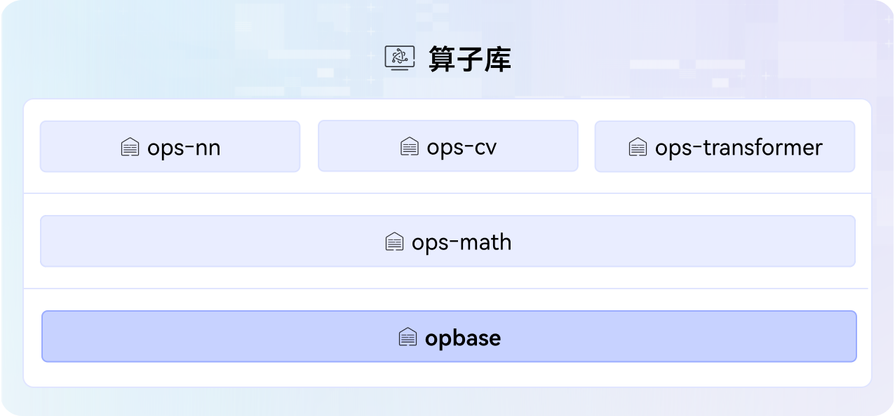

# opbase

## 🔥Latest News

- [2025/09] opbase项目首次上线。

## 🚀概述

opbase是[CANN](https://hiascend.com/software/cann) （Compute Architecture for Neural Networks）算子库中提供算子公共能力的基础框架库，涵盖了op_common基础框架和公共依赖项。



## 🔍目录结构

关键目录如下，详细目录介绍参见[项目目录](./docs/context/dir_structure.md)。

```
├── aicpu_common                   # aicpu公共函数实现
├── build.sh                       # 项目工程编译脚本
├── cmake                          # 项目工程编译目录
├── CMakeLists.txt                 # 算子编译配置文件
├── docs                           # 项目文档介绍
├── include                        # 项目公共头文件      
│   └── aicpu_common               # aicpu公共函数头文件        
├── LICENSE
├── pkg_inc                        # 项目公共头文件            
│   └── op_common                  # op_common源码头文件
├── src
│   └── op_common                  # op_common源码实现
│       ├── atvoss
│       ├── log
│       └── op_host
├── README.md
├── requirements.txt               # 项目依赖的第三方软件包
├── scripts                        # 项目脚本文件存放目录
└── tests                          # 测试工程目录
```

## ⚡️快速入门

若您希望快速体验项目，请访问[快速入门](docs/context/quick_start.md)获取简易教程，包括目录结构介绍、环境搭建、编译执行、本地验证等操作。

- [前提条件](docs/context/quick_start.md#前提条件)：安装软件包之前，请完成基础环境搭建，包括第三方依赖等。
- [环境准备](docs/context/quick_start.md#环境准备)：基础环境搭建后，需完成社区版CANN软件包安装、环境变量配置、源码下载等。
- [编译执行](docs/context/quick_start.md#编译执行)：环境准备好后，可对公共源码修改（如优化、新增等），编译生成的opbase包可部署到AI业务中。
- [本地验证](docs/context/quick_start.md#本地验证)：基于项目根目录的build.sh脚本，可执行UT用例等，快速验证项目功能。

## 📝相关信息

- [贡献指南](CONTRIBUTING.md)
- [安全声明](SECURITY.md)
- [许可证](LICENSE)
