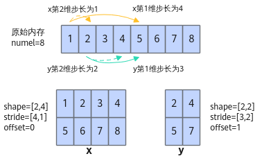

# aclCreateTensor<a name="ZH-CN_TOPIC_0000001983690164"></a>

## 功能说明<a name="section36583473819"></a>

根据Tensor的数据类型、数据排布格式、维度、步长、偏移、Device侧存储地址等数据，创建aclTensor对象，作为单算子API执行接口的入参。

aclTensor是框架定义的一种用来管理和存储张量数据的结构，开发者无需关注其内部实现，直接使用即可。

## 函数原型<a name="section13230182415108"></a>

```
aclTensor *aclCreateTensor(const int64_t *viewDims, uint64_t viewDimsNum, aclDataType dataType, const int64_t *stride, int64_t offset, aclFormat format, const int64_t *storageDims, uint64_t storageDimsNum, void *tensorData)
```

## 参数说明<a name="section75395119104"></a>

>**说明：** 
>
>-   关于aclTensor的StorageShape和ViewShape：
>   -   ViewShape表示Tensor的逻辑shape，是Tensor在实际使用时需要用到的大小。
>   -   StorageShape表示Tensor的实际物理排布shape，是Tensor在内存上实际存在的大小。
>   举例如下：
>   -   StorageShape为\[10, 20\]：表示该Tensor在内存上是按照\[10, 20\]排布的。
>   -   ViewShape为\[2, 5, 20\]：在算子使用时，表示该Tensor可被视为一块\[2, 5, 20\]的数据使用。

<a name="zh-cn_topic_0122830089_table438764393513"></a>
<table><thead align="left"><tr id="zh-cn_topic_0122830089_row53871743113510"><th class="cellrowborder" valign="top" width="18.38%" id="mcps1.1.4.1.1"><p id="zh-cn_topic_0122830089_p1438834363520"><a name="zh-cn_topic_0122830089_p1438834363520"></a><a name="zh-cn_topic_0122830089_p1438834363520"></a>参数名</p>
</th>
<th class="cellrowborder" valign="top" width="26.919999999999998%" id="mcps1.1.4.1.2"><p id="p1769255516412"><a name="p1769255516412"></a><a name="p1769255516412"></a>输入/输出</p>
</th>
<th class="cellrowborder" valign="top" width="54.7%" id="mcps1.1.4.1.3"><p id="zh-cn_topic_0122830089_p173881843143514"><a name="zh-cn_topic_0122830089_p173881843143514"></a><a name="zh-cn_topic_0122830089_p173881843143514"></a>说明</p>
</th>
</tr>
</thead>
<tbody><tr id="zh-cn_topic_0122830089_row2038874343514"><td class="cellrowborder" valign="top" width="18.38%" headers="mcps1.1.4.1.1 "><p id="p18701325105920"><a name="p18701325105920"></a><a name="p18701325105920"></a>viewDims</p>
</td>
<td class="cellrowborder" valign="top" width="26.919999999999998%" headers="mcps1.1.4.1.2 "><p id="p18691425175910"><a name="p18691425175910"></a><a name="p18691425175910"></a>输入</p>
</td>
<td class="cellrowborder" valign="top" width="54.7%" headers="mcps1.1.4.1.3 "><p id="p41858278152"><a name="p41858278152"></a><a name="p41858278152"></a>tensor的ViewShape维度值，为非负整数。</p>
</td>
</tr>
<tr id="row266104418016"><td class="cellrowborder" valign="top" width="18.38%" headers="mcps1.1.4.1.1 "><p id="p9661144705"><a name="p9661144705"></a><a name="p9661144705"></a>viewDimsNum</p>
</td>
<td class="cellrowborder" valign="top" width="26.919999999999998%" headers="mcps1.1.4.1.2 "><p id="p966244704"><a name="p966244704"></a><a name="p966244704"></a>输入</p>
</td>
<td class="cellrowborder" valign="top" width="54.7%" headers="mcps1.1.4.1.3 "><p id="p151851427151512"><a name="p151851427151512"></a><a name="p151851427151512"></a>tensor的ViewShape维度数。</p>
</td>
</tr>
<tr id="row68843458011"><td class="cellrowborder" valign="top" width="18.38%" headers="mcps1.1.4.1.1 "><p id="p388414451014"><a name="p388414451014"></a><a name="p388414451014"></a>dataType</p>
</td>
<td class="cellrowborder" valign="top" width="26.919999999999998%" headers="mcps1.1.4.1.2 "><p id="p10884845605"><a name="p10884845605"></a><a name="p10884845605"></a>输入</p>
</td>
<td class="cellrowborder" valign="top" width="54.7%" headers="mcps1.1.4.1.3 "><p id="p14185627171510"><a name="p14185627171510"></a><a name="p14185627171510"></a>tensor的数据类型。</p>
</td>
</tr>
<tr id="row20223152605"><td class="cellrowborder" valign="top" width="18.38%" headers="mcps1.1.4.1.1 "><p id="p12238521105"><a name="p12238521105"></a><a name="p12238521105"></a>stride</p>
</td>
<td class="cellrowborder" valign="top" width="26.919999999999998%" headers="mcps1.1.4.1.2 "><p id="p422355218011"><a name="p422355218011"></a><a name="p422355218011"></a>输入</p>
</td>
<td class="cellrowborder" valign="top" width="54.7%" headers="mcps1.1.4.1.3 "><p id="p91851327111510"><a name="p91851327111510"></a><a name="p91851327111510"></a>tensor各维度元素的访问步长<span>，为非负整数</span>。</p>
</td>
</tr>
<tr id="row8316153718120"><td class="cellrowborder" valign="top" width="18.38%" headers="mcps1.1.4.1.1 "><p id="p531615371314"><a name="p531615371314"></a><a name="p531615371314"></a>offset</p>
</td>
<td class="cellrowborder" valign="top" width="26.919999999999998%" headers="mcps1.1.4.1.2 "><p id="p183166375110"><a name="p183166375110"></a><a name="p183166375110"></a>输入</p>
</td>
<td class="cellrowborder" valign="top" width="54.7%" headers="mcps1.1.4.1.3 "><p id="p4185102781512"><a name="p4185102781512"></a><a name="p4185102781512"></a>tensor首元素相对于storage的偏移，<span>为非负整数</span>。</p>
</td>
</tr>
<tr id="row82891505013"><td class="cellrowborder" valign="top" width="18.38%" headers="mcps1.1.4.1.1 "><p id="p1128917503014"><a name="p1128917503014"></a><a name="p1128917503014"></a>format</p>
</td>
<td class="cellrowborder" valign="top" width="26.919999999999998%" headers="mcps1.1.4.1.2 "><p id="p32899501406"><a name="p32899501406"></a><a name="p32899501406"></a>输入</p>
</td>
<td class="cellrowborder" valign="top" width="54.7%" headers="mcps1.1.4.1.3 "><p id="p161852274155"><a name="p161852274155"></a><a name="p161852274155"></a>tensor的数据排布格式。</p>
</td>
</tr>
<tr id="row118037481909"><td class="cellrowborder" valign="top" width="18.38%" headers="mcps1.1.4.1.1 "><p id="p128038487015"><a name="p128038487015"></a><a name="p128038487015"></a>storageDims</p>
</td>
<td class="cellrowborder" valign="top" width="26.919999999999998%" headers="mcps1.1.4.1.2 "><p id="p148038481703"><a name="p148038481703"></a><a name="p148038481703"></a>输入</p>
</td>
<td class="cellrowborder" valign="top" width="54.7%" headers="mcps1.1.4.1.3 "><p id="p161851627111520"><a name="p161851627111520"></a><a name="p161851627111520"></a>tensor的StorageShape维度值，<span>为非负整数</span>。</p>
</td>
</tr>
<tr id="row370244019115"><td class="cellrowborder" valign="top" width="18.38%" headers="mcps1.1.4.1.1 "><p id="p170214401218"><a name="p170214401218"></a><a name="p170214401218"></a>storageDimsNum</p>
</td>
<td class="cellrowborder" valign="top" width="26.919999999999998%" headers="mcps1.1.4.1.2 "><p id="p1170234019111"><a name="p1170234019111"></a><a name="p1170234019111"></a>输入</p>
</td>
<td class="cellrowborder" valign="top" width="54.7%" headers="mcps1.1.4.1.3 "><p id="p14185132771513"><a name="p14185132771513"></a><a name="p14185132771513"></a>tensor的StorageShape维度数。</p>
</td>
</tr>
<tr id="row19877387118"><td class="cellrowborder" valign="top" width="18.38%" headers="mcps1.1.4.1.1 "><p id="p14988538415"><a name="p14988538415"></a><a name="p14988538415"></a>tensorData</p>
</td>
<td class="cellrowborder" valign="top" width="26.919999999999998%" headers="mcps1.1.4.1.2 "><p id="p5988103815119"><a name="p5988103815119"></a><a name="p5988103815119"></a>输入</p>
</td>
<td class="cellrowborder" valign="top" width="54.7%" headers="mcps1.1.4.1.3 "><p id="p618520277151"><a name="p618520277151"></a><a name="p618520277151"></a>tensor在Device侧的存储地址。</p>
</td>
</tr>
</tbody>
</table>

## 返回值说明<a name="section25791320141317"></a>

成功则返回创建好的aclTensor，否则返回nullptr。

## 约束说明<a name="section20759749885"></a>

-   本接口需与[aclDestroyTensor](aclDestroyTensor.md)接口配套使用，分别完成aclTensor的创建与销毁。
-   如需创建多个aclTensor对象，可调用[aclCreateTensorList](aclCreateTensorList.md)接口来存储张量列表。
-   调用[aclGetDataType](aclGetDataType.md)接口可以获取aclTensor的DataType。
-   调用[aclGetFormat](aclGetFormat.md)接口可以获取aclTensor的format。
-   调用[aclGetStorageShape](aclGetStorageShape.md)接口可以获取aclTensor的StorageShape。
-   调用[aclGetViewOffset](aclGetViewOffset.md)接口可以获取aclTensor的ViewOffset，即ViewShape对应的offset。
-   调用[aclGetViewShape](aclGetViewShape.md)接口可以获取aclTensor的ViewShape。
-   调用[aclGetViewStrides](aclGetViewStrides.md)接口可以获取aclTensor的ViewStrides，即ViewShape对应的stride。
-   调用[aclInitTensor](aclInitTensor.md)接口初始化给定tensor的参数。
-   调用如下接口可刷新或获取不同场景下aclTensor中记录的Device内存地址。
    -   [aclSetInputTensorAddr](aclSetInputTensorAddr.md)
    -   [aclSetOutputTensorAddr](aclSetOutputTensorAddr.md)
    -   [aclSetTensorAddr](aclSetTensorAddr.md)
    -   [aclGetRawTensorAddr](aclGetRawTensorAddr.md)
    -   [aclSetRawTensorAddr](aclSetRawTensorAddr.md)

## 调用示例<a name="section19778015193010"></a>

aclTensor的定义与[torch.Tensor](https://pytorch.org/docs/stable/tensors.html)相似，由一块连续或非连续的内存地址和一系列描述信息（如stride、offset等）组成。Tensor根据shape、stride、offset信息，可自由取出内存中的数据，也可获得非连续的内存（如[图1](#fig1414993015518)中y）。

**图 1**  tensor逻辑结构<a name="fig1414993015518"></a>  


-   以[图1](#fig1414993015518)为例，x tensor创建过程如下：

    ```
    aclTensor *CreateXTensor()
    {    
        std::vector<int64_t> viewDims = {2, 4};
        std::vector<int64_t> stride = {4, 1}; // 第1维步长4，第2维步长1
        std::vector<int64_t> storageDims = {2, 4};       
        return aclCreateTensor(viewDims.data(), 2, ACL_FLOAT16, stride.data(), 0, ACL_FORMAT_ND, storageDims.data(), 2, nullptr);
    }
    ```

-   以[图1](#fig1414993015518)为例，x对应的转置x^T tensor创建过程如下：

    ```
    aclTensor *CreateXTransposedTensor()
    {
        std::vector<int64_t> viewDims = {4, 2};       
        std::vector<int64_t> stride = {1, 4};         // 转置跨度通过stride表示
        std::vector<int64_t> storageDims = {2, 4};    
        return aclCreateTensor(viewDims.data(), 2, ACL_FLOAT16, stride.data(), 0, ACL_FORMAT_ND, storageDims.data(), 2, nullptr);
    }
    ```

基于上述举例，将aclTensor作为单算子API执行接口入参的示例代码如下，仅供参考，不支持直接拷贝运行。

```
// 创建aclTensor
aclTensor *xTensor = CreateXTensor();
aclTensor *xTransposedTensor = CreateXTransposedTensor();
// aclTensor作为单算子API执行接口的入参
auto ret = aclxxXxxGetWorkspaceSize(xTensor, xTransposedTensor, ..., outTensor, ..., &workspaceSize, &executor);
ret = aclxxXxx(...);
...
// 销毁aclTensor
ret = aclDestroyTensor(xTensor);
ret = aclDestroyTensor(xTransposedTensor);
```

